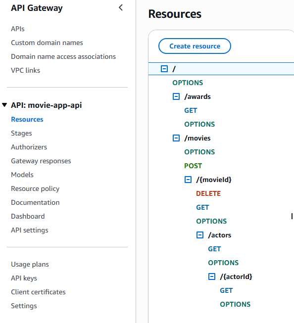
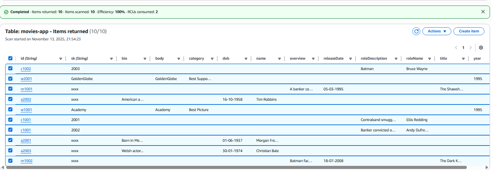

# Assignment — Cloud App Development

**Name:** Jacob Dickson  
**Project:** Movie API — AWS CDK (IaC, Serverless)  
**Region:** eu-west-1  
**Stacks:** `AuthStack`, `DataStack`, `AppApiStack` (CDK / CloudFormation)

---

## Links

- **GitHub repo:** https://github.com/JacobDicksonOfficial/movie-api-cdk  
- **Demo video:** _[add YouTube link here]_  
- **Auth API base URL:** _[from CloudFormation → AuthStack Outputs → `AuthApiUrl`]_  
- **App API base URL:** _[from CloudFormation → AppApiStack Outputs → `AppApiUrl`]_

> _Note:_ The Auth API code follows the labs. This assignment focuses on the App API per spec.

---

## Screenshots

### 1) App Web API (management console)

- Console → **API Gateway** → **movie-app-api** → **Resources**.  
- Expand to show:
  - `GET /movies/{movieId}` (Cognito authorizer)
  - `GET /movies/{movieId}/actors`
  - `GET /movies/{movieId}/actors/{actorId}`
  - `GET /awards` (with query string)
  - `POST /movies` (**x-api-key** required)
  - `DELETE /movies/{movieId}` (**x-api-key** required)




### 2) Seeded DynamoDB table

- Console → **DynamoDB** → **Tables** → `movies-app` → **Explore items**.  
- Show a mix of items to demonstrate the single-table prefixes:
  - Movie: `id = m1001 | sk = xxxx`
  - Cast : `id = c1001 | sk = 2001`
  - Award: `id = w1001 | sk = Academy`




### 3) CloudWatch — User Activity log (GETs) & State Change log (POST/DELETE)

- Console → **CloudWatch** → **Logs** → **Log groups** → `/aws/lambda/GetMovieFn` (or any GET fn).  
  - Find a line like:
    ```
    doconnor /movies/1001
    ```
- Console → **CloudWatch** → **Logs** → `/aws/lambda/StateChangeLoggerFn`.  
  - Find lines like:
    ```
    POST + w1001 | Academy | Best Movie | 1995
    DELETE m1002 | xxxx | The Dark Knight | 18-07-2008 | ...
    ```

## What’s deployed (design summary)

### Single-table DynamoDB (`movies-app`)
- **Keys:** `id` (PK, String), `sk` (SK, String)  
- **Billing:** On-Demand, **PITR:** ON, **Streams:** `NEW_AND_OLD_IMAGES`
- **Entity keying (prefix) rules:**
  - **Movie**: `id = m{movieId}`, `sk = xxxx`
  - **Actor**: `id = a{actorId}`, `sk = xxxx`
  - **Cast** : `id = c{movieId}`, `sk = {actorId}` (string)
  - **Award**: `id = w{movieId}` or `w{actorId}`, `sk = {awardBody}`
- **Access pattern policy:** Only **GetItem/Query**, no scans.

### Auth (Cognito + Auth API)
- **User Pool:** `movie-api-users`, email sign-in, self-signup, email verify.  
- **Client:** `movie-api-client` (no secret).  
- **Auth API (REST):** `/auth/register`, `/auth/login`, `/auth/logout`.

### App API (REST)
- **GET** routes → **Cognito JWT** required via **User Pools Authorizer**.
- **POST/DELETE** → **API Key + Usage Plan** (admin).
- Routes:
  - `GET /movies/{movieId}`
  - `GET /movies/{movieId}/actors`
  - `GET /movies/{movieId}/actors/{actorId}`
  - `GET /awards?movie=&actor=&awardBody=` (all combinations supported)
  - `POST /movies`
  - `DELETE /movies/{movieId}` (cascade delete cast & awards)

### Logging & Ops
- **GET** Lambdas log: `<username> <path?query>`.  
- **StateChangeLoggerFn** (DynamoDB Stream consumer) logs:
  - `POST + <item printable>`
  - `DELETE <item printable>`
- **CloudWatch**: log retention set to 30 days and a basic Lambda error alarm
